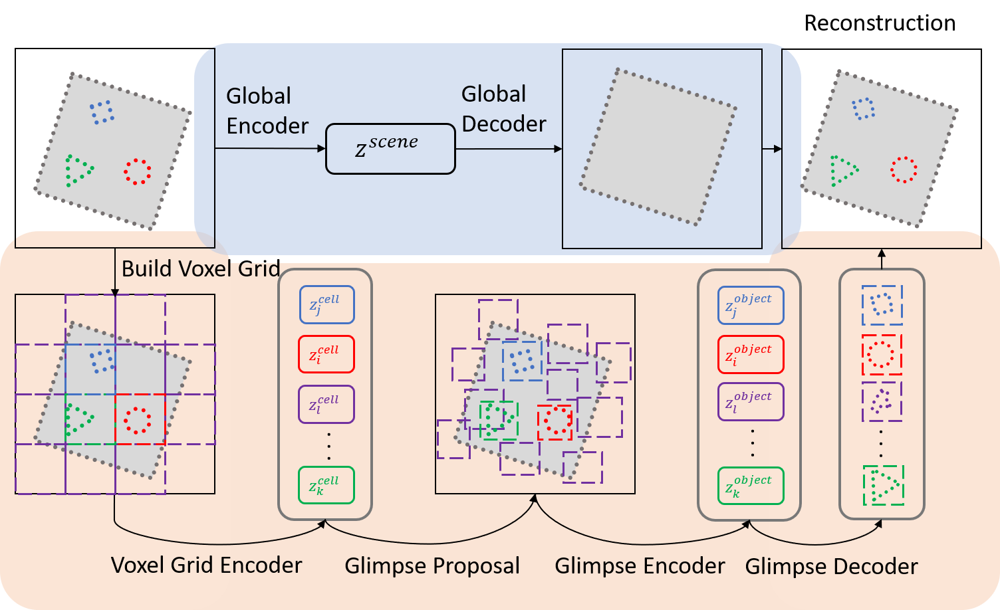
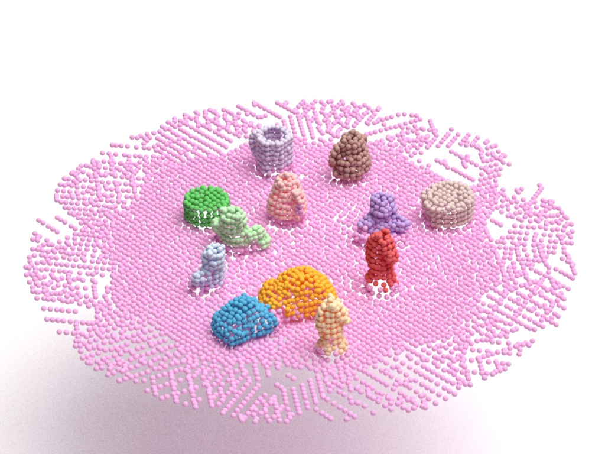

# Spatially Invariant Unsupervised 3D Object-Centric Learning and Scene Decomposition

This repo contains the official Pytorch implementation of the paper:

[Spatially Invariant Unsupervised 3D Object-Centric Learning and Scene Decomposition](https://arxiv.org/abs/2106.05607) ECCV 2022

<!--  -->



<!--  -->

### Dependency
---

- pytorch 1.8.1
- pytorch-geomertic (PyG) 2.0.1
- tensorboard 2.5.0
- tensorflow 2.4.1
- sklearn
- pretty_errors
- simplejson
- tqdm

### Dataset
---

[UOR point cloud](https://cloudstor.aarnet.edu.au/plus/s/9xMQxsEgkUWJqaT)

[UOT point cloud](https://cloudstor.aarnet.edu.au/plus/s/2Yjoe1bWZa7nip3)

### Cite
---
In case you find our work useful:

```latex
@article{pointflow,
 title={Spatially Invariant Unsupervised 3D Object-Centric Learning and Scene Decomposition},
 author={Wang, Tianyu and Liu, Miaomiao and Ng, Kee Siong},
 journal={arXiv preprint arXiv:2106.05607},
 year={2022}
}
```